# Synthetic scanned text image for text recogniton 

## What is it for?
Generating text image samples to train and test an OCR software.

## How to set up 
- create your own environment and install required packages 
```
conda create -n env
conda activae env
pip install -r -requirements.txt
```

## How does it work?
By default, images will be generated by using texts, text colors, fonts and backgrounds; randomly chosen from dataset folder,
then they will be saved to 'output' folder. 

**For example**
* -n : the number of output images 
* -i : a specified text file as source for the text
```
python run.py -n 3 -i ./dataset/texts/en.txt 
```
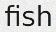
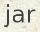
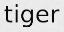

```
python run.py -n 3 -i ./dataset/texts/th.txt 
```
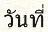
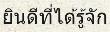
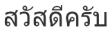

**Definitely, You can set any texts and fonts.** 
* -txt : text used for image generation
* -ft : font directoty  

```
python run.py -n 3 -txt 薪水
```
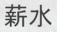
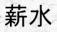
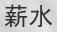

```
python run.py -n 3 -txt नमस्ते -ft ./dataset/fonts/Prompt/Prompt-Medium.ttf
```
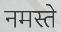
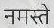
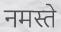

**Text skewing**
* -sk : randomly rotate image between (-sk, sk)
```
python run.py -n 3 -txt rotate -sk 5
```
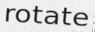
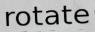
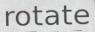